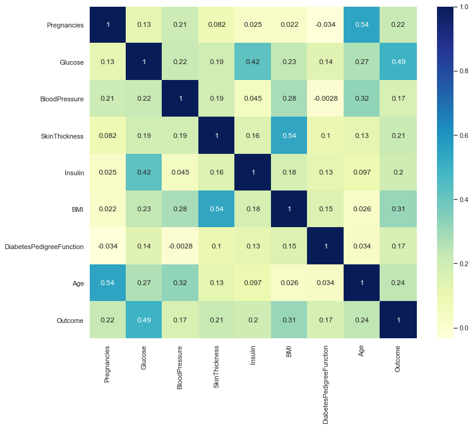

# Diabetes-Prediction-Detection-App

Simple App which can detect Weather you are diagnoised with Diabetic or not depending up on users data provided to the application.
* Created an app that detects wheather they have have Diabetics or not to help doctors with 89% accuracy .
* Data collected from Open source websites from Internet .
* Processed features to make data look's like perfect and to get good accuracy with less loss
* I had used Ada boost Classifier ,XGBoost ,Logistic ,support vector to reach best model
* Deployed model on Heroku .

## Code and Resources Used :
* Python Version : 3.7
* Packages: pandas, numpy, sklearn, matplotlib, seaborn, selenium, flask, json, pickle
* For Web Framework Requirements: pip install -r requirements.txt

## Exploratory Data Analysis :

> To know relationship between every feature i had used corr()
## Model Building :
First, I transformed the categorical variables into dummy variables. I also split the data into train and tests sets with a test size of 20%.
I tried three different models and evaluated them using Classification Metrics. I chose Confusion Matrix Because it's better to understand how many features are going to support and not going to support .
I tried Five different models:

* Support Vector Classifier: It classifies data perfectly
* Logistic Regression
* K-Nearest Neighbour Classifier
* Naive Bayes Classifier
* XGBoost Classifier
## Model Performance :
* To measure the performance of every model i had used classification metrics ,it is one of the best way to know which model is best depending up on all the metrics.
## Productionization :
* In this step , I had deployed Model on heroku with Flask api.
* The API endpoint takes in a request with a values by end user and returns weather they have Diabetes or not . Here is URL to predict [Diabetes Identification Web App](https://diabetics-prediction-system.herokuapp.com/)
